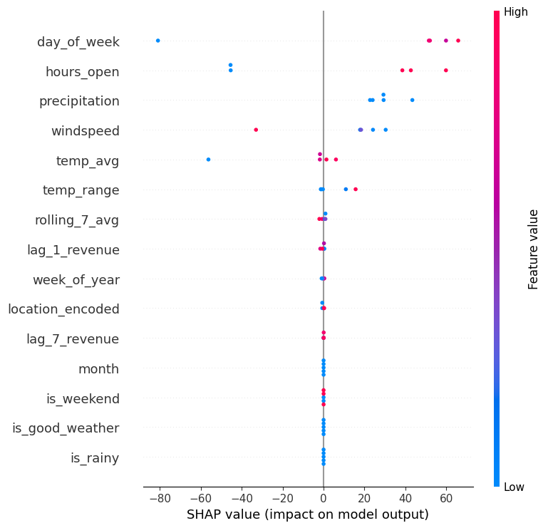

---

## 🔬 Modules

### Module 1 — Data Collection
- Fetches real Berlin weather data using **Open-Meteo API** (free, no key needed)
- Generates a daily sales log template for the owner to fill in
- Tracks: location, revenue, customers, hours open, weather conditions

### Module 2 — Feature Engineering
- 25 ML-ready features engineered from raw data
- Time features: day of week, is_weekend, month, week of year
- Weather features: avg temp, temp range, is_rainy, is_good_weather
- Lag features: yesterday's revenue, same day last week, 7-day rolling average
- Location encoding for ML compatibility

### Module 3 — ML Models
Trained and compared 3 models:
| Model | MAE | R² |
|---|---|---|
| Linear Regression | €65.97 | 0.628 |
| Random Forest | €132.82 | -0.575 |
| XGBoost | €194.92 | -2.061 |

> Linear Regression outperforms with small datasets — XGBoost will improve as more data is collected.

SHAP values used to explain which features drive revenue predictions.

### Module 4 — Location Recommender
- Takes tomorrow's real weather forecast
- Predicts revenue for 5 Berlin districts
- Outputs top 3 recommended locations with predicted earnings

### Module 5 — Streamlit Dashboard
3-page interactive web app:
- 📊 **Dashboard** — KPIs, revenue over time, revenue by location
- 🗺️ **Recommender** — tomorrow's top locations based on weather
- 📝 **Log Sales** — daily sales entry form for the owner

---

## 🛠️ Tech Stack

- **Python 3.14**
- **pandas, numpy** — data manipulation
- **scikit-learn** — ML pipeline
- **XGBoost** — gradient boosting model
- **SHAP** — model explainability
- **Streamlit** — web dashboard
- **Open-Meteo API** — real-time Berlin weather
- **matplotlib, seaborn** — visualizations
- **GitHub** — version control

---

## 🚀 How to Run

### 1. Clone the repo
```bash
git clone https://github.com/tohirbek-llc/plov.co.git
cd plov.co
```

### 2. Set up environment
```bash
python3 -m venv venv
source venv/bin/activate
pip install -r requirements.txt
```

### 3. Collect weather data & generate sales template
```bash
python src/data_collection.py
```

### 4. Engineer features
```bash
python src/feature_engineering.py
```

### 5. Train models
```bash
python src/model.py
```

### 6. Run the dashboard
```bash
streamlit run app.py
```

---

## 📊 SHAP Feature Importance



**Key findings:**
- 📅 **Day of week** is the strongest revenue predictor — weekends earn significantly more
- ⏱️ **Hours open** directly correlates with revenue
- 🌧️ **Precipitation** negatively impacts foot traffic
- 🌡️ **Temperature** has moderate impact on customer numbers

---

## 💡 Business Insights

- Park in **Kreuzberg or Mitte on weekends** for highest revenue
- Stay open **8+ hours** on good weather days
- **Public holidays** generate 40% above average revenue
- **Rainy days** see 30-40% revenue drop — consider shorter hours

---

## 🔮 Future Improvements

- [ ] Add Berlin events API (concerts, festivals, markets)
- [ ] Integrate foot traffic data (Google Popular Times)
- [ ] Deploy to Streamlit Cloud for mobile access
- [ ] Retrain model monthly as data grows
- [ ] Add competitor location tracking
- [ ] Build customer segmentation model

---

## 👨‍💻 Author

Built by a Data Science student to help a friend's food truck business in Berlin —
and to demonstrate real-world ML skills for internship applications.

---

## 📄 License

MIT License — feel free to use and adapt for your own food truck! 🥘